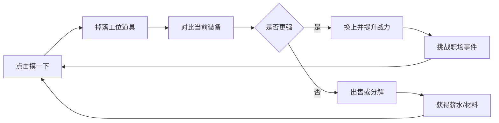
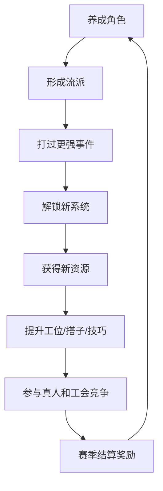

# 《今日宜摸鱼》大项目方案

> 版本：0.1  
> 类型：竖屏放置养成 + 自动战斗 + 真人挑战 + 工会协作  
> 核心主题：上班摸鱼、职场荒诞、Q 版国风办公室幻想  
> 目标体验：点一下就有反馈，刷一会就有提升，养几天就有流派，玩一季就有社交身份。

## 1. 项目一句话

《今日宜摸鱼》是一款以“上班摸鱼”为主题的竖屏放置 RPG。玩家扮演一位隐藏在办公室里的摸鱼高手，通过点击摸鱼、获取工位道具、培养摸鱼搭子、修炼职场技巧、挑战真人玩家和参与工会大战，逐步从“实习摸鱼”成长为“无痕带薪宗师”。

核心不是简单换皮，而是把传统放置修仙的成长爽感改造成一个有梗、有社交、有构筑、有长期追求的职场幻想世界。

## 2. 产品定位

### 2.1 目标用户

| 用户类型 | 需求 | 本项目满足方式 |
| --- | --- | --- |
| 放置养成玩家 | 每天上线都有成长 | 挂机收益、装备掉落、段位突破、伙伴升级 |
| 数值构筑玩家 | 想研究流派搭配 | 连摸、暴摸、闪查、反卷、装忙、续命等流派 |
| 轻度休闲玩家 | 想要轻松搞笑 | 职场梗、摸鱼按钮、老板巡查、日报糊弄 |
| 社交竞争玩家 | 想和真人比强弱 | 真人挑战、摸鱼榜、工会挑战、跨服部门战 |
| 收集玩家 | 想收集外观和图鉴 | 工位皮肤、搭子图鉴、称号、办公神器 |

### 2.2 核心卖点

1. **上班摸鱼题材足够大众**：玩家一看就懂，一玩就有代入感。
2. **点击掉落反馈强**：点击“摸一下”立刻获得随机工位道具。
3. **职场梗和数值系统结合**：老板巡查、会议突袭、日报审判都能变成战斗内容。
4. **真人挑战增加长期竞争**：不是纯单机刷数值，有真人镜像、实时挑战和赛季榜。
5. **工会系统天然贴题**：把传统公会做成“工会/部门”，能打团、摸鱼、抢福利。
6. **视觉差异明显**：国风修炼 UI 的质感加上办公室道具，形成“职场修炼台”的独特美术方向。

## 3. 世界观与调性

### 3.1 世界观

玩家所在的公司叫 **大千职场有限公司**。这里每个人都有一个隐藏属性：摸鱼天赋。

普通员工每天被 KPI、会议、需求变更和老板巡查压制，而真正的高手可以在不影响表面忙碌的情况下积累摸鱼值，修炼工位技巧，召集摸鱼搭子，加入工会，最终在年度绩效审判中全身而退。

### 3.2 关键词

| 传统表达 | 本项目表达 |
| --- | --- |
| 修为 | 摸鱼值 |
| 战力 | 摸鱼战力 |
| 境界 | 摸鱼段位 |
| 装备 | 工位道具 |
| 灵兽 | 摸鱼搭子 |
| 神通 | 职场技巧 |
| 法宝 | 办公神器 |
| 宗门/公会 | 工会/部门 |
| 妖王 | 老板/会议/绩效 |
| 斗法 | 真人挑战 |

### 3.3 美术调性

使用 Q 版国风移动 RPG 的界面密度和质感，但主题元素替换为办公室幻想：

- 背景：青绿墨色办公室、夜班灯光、窗外城市雾气、桌面灵光。
- 主角：大头小身 Q 版打工人，眼神清醒，动作偷偷摸鱼。
- 工位：像修炼台一样的办公桌，有电脑、耳机、咖啡、水杯、便签、工牌。
- UI：深青玉面板、金色笔触标题、橙金主按钮、蓝绿色灵感光效。
- 视觉反差：老板巡查可以有压迫感，但整体保持可爱、荒诞、轻松。

## 4. 核心循环

### 4.1 单次操作循环



### 4.2 日常循环

1. 领取挂机收益。
2. 点击摸鱼刷道具。
3. 清理背包并强化流派。
4. 挑战老板巡查和会议突袭。
5. 参与真人挑战，冲击摸鱼榜。
6. 加入工会任务，贡献摸鱼进度。
7. 完成日报、周报、活动任务。
8. 离线挂机，等待下次收益。

### 4.3 长线循环



## 5. 玩家核心属性

### 5.1 基础属性

| 属性 | 含义 | 作用 |
| --- | --- | --- |
| 摸鱼效率 | 攻击力 | 决定对敌方造成的基础压力伤害 |
| 抗压值 | 生命值 | 归零则本次挑战失败 |
| 伪装能力 | 防御力 | 降低敌方巡查、会议、绩效伤害 |
| 摸鱼速度 | 速度 | 决定出手顺序 |
| 灵感值 | 技能能量 | 释放职场技巧需要消耗 |
| 工位稳定 | 韧性 | 降低被打断、扣资源、封技能的概率 |

### 5.2 构筑属性

| 属性 | 定位 | 示例效果 |
| --- | --- | --- |
| 连摸 | 连击 | 行动后概率追加一次普通摸鱼 |
| 暴摸 | 暴击 | 造成更高摸鱼伤害 |
| 闪查 | 闪避 | 躲避老板巡查或真人攻击 |
| 反卷 | 反击 | 被攻击后概率反打 |
| 装忙 | 减伤 | 受到攻击时临时进入忙碌伪装 |
| 续杯 | 回复 | 行动后回复抗压值 |
| 糊弄 | 控制 | 降低敌方命中或延迟敌方行动 |
| 摆烂 | 特殊 | 血量越低，减伤和反击越高 |
| 背锅转移 | 转嫁 | 概率把部分伤害转移为敌方自损 |
| 情绪稳定 | 抗控 | 降低沉默、眩晕、降速效果 |

## 6. 摸鱼段位

段位决定系统解锁、基础属性成长和称号展示。

| 阶段 | 名称 | 解锁重点 |
| --- | --- | --- |
| 1 | 实习摸鱼 | 主按钮、掉落工位道具 |
| 2 | 工位新手 | 装备槽、出售、分解 |
| 3 | 茶水间行者 | 老板巡查 |
| 4 | 会议隐身者 | 职场技巧 |
| 5 | 日报糊弄师 | 日报系统、挂机收益强化 |
| 6 | 带薪发呆者 | 摸鱼搭子 |
| 7 | 反卷斗士 | 真人挑战 |
| 8 | 工位炼器师 | 工位改造、神器 |
| 9 | 部门潜伏者 | 工会系统 |
| 10 | 无痕摸鱼宗师 | 跨服、赛季、终局挑战 |

## 7. 主界面设计

### 7.1 首屏结构

竖屏优先，不做落地页，打开就是游戏。

| 区域 | 内容 |
| --- | --- |
| 顶部状态条 | 薪水、咖啡、灵感、绩效点、头像、战力 |
| 中央场景 | 主角坐在工位，电脑发光，老板影子偶尔经过 |
| 主按钮 | `摸一下`，金橙色大按钮 |
| 掉落提示 | 新道具弹出，对比当前装备 |
| 装备区 | 8 个工位道具槽 |
| 事件入口 | 老板巡查、会议突袭、日报审判 |
| 底部导航 | 工位、背包、搭子、技巧、挑战、工会 |

### 7.2 主界面即时反馈

- 点击时电脑屏幕闪光，主角做小动作。
- 掉落普通道具时小弹窗。
- 掉落高品质道具时全屏短动画。
- 老板靠近时屏幕边缘出现红色警戒。
- 背包满时按钮变成“清包再摸”。
- 真人挑战邀请出现时顶部工牌闪烁。

## 8. 工位道具系统

### 8.1 装备槽位

| 槽位 | 功能定位 | 可出现词条 |
| --- | --- | --- |
| 电脑 | 主输出 | 摸鱼效率、暴摸、技能伤害 |
| 键盘 | 多段输出 | 连摸、速度、反卷 |
| 耳机 | 躲避伪装 | 闪查、糊弄、抗控 |
| 水杯 | 续航 | 续杯、抗压、减伤 |
| 椅子 | 防御 | 装忙、抗压、工位稳定 |
| 工牌 | 特殊身份 | 全属性、段位加成、真人加成 |
| 便签 | 技能辅助 | 灵感、冷却缩减、控制命中 |
| 零食 | 资源收益 | 薪水加成、挂机加成、分解加成 |

### 8.2 品质

| 品质 | 颜色 | 特点 |
| --- | --- | --- |
| 普通 | 灰白 | 基础属性 |
| 精良 | 绿色 | 1 条副词条 |
| 稀有 | 蓝色 | 2 条副词条 |
| 史诗 | 紫色 | 3 条副词条 |
| 传说 | 金色 | 4 条副词条 |
| 摸鱼神器 | 红金 | 4 条副词条 + 专属效果 |
| 传世工位 | 彩光 | 赛季或活动限定特效 |

### 8.3 道具处理

- `换上`：立即替换当前槽位。
- `出售`：获得薪水。
- `分解`：获得零件和灵感碎片。
- `锁定`：避免批量处理。
- `收藏`：加入图鉴，保留外观。
- `一键清包`：按品质、战力、词条规则自动处理。
- `智能推荐`：按当前流派推荐是否保留。

### 8.4 道具专属效果示例

| 道具名 | 槽位 | 专属效果 |
| --- | --- | --- |
| 静音机械键盘 | 键盘 | 连摸触发时额外提升 5% 灵感 |
| 领导同款保温杯 | 水杯 | 抗压值低于 30% 时自动续杯 |
| 摸鱼双屏显示器 | 电脑 | 暴摸后概率触发一次假装工作 |
| 防背刺工牌 | 工牌 | 真人挑战中首次致命伤害变为 1 点 |
| 祖传便签纸 | 便签 | 日报糊弄成功率提升 |
| 人体工学神椅 | 椅子 | 装忙期间减伤提高 |

## 9. 职场技巧系统

技巧是主动/被动技能，决定战斗节奏。

### 9.1 技巧类型

| 类型 | 说明 | 示例 |
| --- | --- | --- |
| 主动技巧 | 战斗中消耗灵感释放 | 假装开会、文档糊弄术 |
| 被动技巧 | 常驻加成 | 带薪发呆、表情管理 |
| 反应技巧 | 被攻击时触发 | Alt+Tab 神功、老板雷达 |
| 资源技巧 | 提高收益 | 日报炼金、茶水间补给 |
| 真人技巧 | PVP 专用 | 话术压制、反向甩锅 |

### 9.2 技巧示例

| 技巧名 | 效果 |
| --- | --- |
| Alt+Tab 神功 | 提高闪查，成功闪查后获得灵感 |
| 假装开会 | 获得护盾，降低接下来受到的伤害 |
| 文档糊弄术 | 对敌人造成伤害，并降低其命中 |
| 咖啡续命 | 回复抗压值，若处于低血量则额外回复 |
| 带薪发呆 | 提高挂机收益 |
| 需求反弹 | 受到技能攻击后概率反击 |
| 日报炼金 | 完成日常后额外获得薪水 |
| 表情管理 | 降低被控制概率 |
| 空窗口凝视 | 下一次攻击必定触发装忙 |
| 消息已读不回 | 真人挑战中降低敌方速度 |

## 10. 摸鱼搭子系统

搭子是伙伴系统，提供战斗、收益、社交加成。

### 10.1 搭子定位

| 搭子 | 定位 | 技能方向 |
| --- | --- | --- |
| 前台情报员 | 预警 | 提高闪查，提前发现老板巡查 |
| 咖啡师同事 | 续航 | 提高回复，降低疲劳 |
| 产品同事 | 混乱 | 降低敌方命中，引发需求互撞 |
| 测试同事 | 反击 | 被攻击后概率触发反卷 |
| AI 助手 | 效率 | 提高挂机收益和技能伤害 |
| 法务同事 | 防御 | 降低背锅概率，提高抗控 |
| 财务同事 | 资源 | 提高薪水收益 |
| 运营同事 | 活动 | 提高活动奖励 |

### 10.2 搭子羁绊

| 羁绊名 | 组合 | 效果 |
| --- | --- | --- |
| 茶水间联盟 | 前台 + 咖啡师 | 闪查后回复抗压值 |
| 需求闭环 | 产品 + 测试 | 反击时降低敌方伪装 |
| 自动化办公 | AI 助手 + 运营 | 挂机收益提高 |
| 合规摸鱼 | 法务 + 财务 | 工会挑战中减伤 |
| 会议消失术 | 前台 + 产品 + AI 助手 | 会议突袭中首回合免伤 |

### 10.3 搭子养成

- 等级：消耗工牌碎片。
- 星级：消耗同名碎片。
- 羁绊：上阵特定搭子激活。
- 专属道具：提升搭子的特殊技能。
- 好感度：通过赠送咖啡、零食、表情包提升。

## 11. 自动战斗系统

### 11.1 战斗定位

战斗不强调复杂操作，而强调养成、构筑和战报趣味。

### 11.2 战斗流程

1. 根据摸鱼速度决定先手。
2. 普通行动造成摸鱼效率相关伤害。
3. 判定连摸、暴摸、闪查、反卷等词条。
4. 灵感达到阈值后释放职场技巧。
5. 抗压值归零的一方失败。
6. 生成简短战报和奖励。

### 11.3 敌方事件

| 事件 | 特点 | 掉落 |
| --- | --- | --- |
| 老板巡查 | 高单体压力 | 薪水、工位零件 |
| 会议突袭 | 多段伤害、降速 | 灵感、技巧书 |
| 日报审判 | 控制、持续伤害 | 日报印章 |
| 需求变更 | 随机削弱玩家属性 | 重构碎片 |
| 加班警报 | 长线消耗战 | 咖啡、抗压材料 |
| 绩效面谈 | 高难 Boss | 绩效点、高品质道具 |

## 12. 真人挑战系统

真人挑战是项目的长期竞争核心。目标是让玩家感觉自己不是只在刷电脑，而是在和其他“摸鱼高手”斗智斗数值。

### 12.1 模式总览

| 模式 | 是否实时 | 核心体验 |
| --- | --- | --- |
| 摸鱼榜挑战 | 异步 | 挑战其他玩家镜像，冲排名 |
| 实时摸鱼对决 | 半实时 | 双方选择战术卡，自动结算 |
| 办公室擂台 | 异步赛季 | 连胜、守擂、排名奖励 |
| 反卷竞技场 | 异步 | 限定流派和规则，考构筑 |
| 好友切磋 | 可实时 | 无消耗测试阵容 |
| 伪装大赛 | 异步 | 比拼低战力高胜率的奇葩构筑 |

### 12.2 摸鱼榜挑战

这是最基础的 PVP。

- 玩家选择排行榜上的目标。
- 系统读取目标的防守阵容、装备、搭子和技巧。
- 战斗自动进行。
- 胜利后交换或提升排名。
- 每天有免费挑战次数，可用咖啡购买额外次数。
- 每日 22:00 结算排名奖励。

奖励包括绩效点、荣誉工牌、限定称号和赛季币。

### 12.3 实时摸鱼对决

半实时玩法，每局 60 到 90 秒，避免操作过重。

流程：

1. 匹配真人玩家。
2. 双方展示头像、段位、主流派。
3. 每 3 回合出现一次战术选择。
4. 玩家从 3 张战术卡中选 1 张。
5. 选择后继续自动战斗。

战术卡示例：

| 卡名 | 效果 |
| --- | --- |
| 假装接电话 | 本回合提高闪查 |
| 甩出会议纪要 | 对敌方造成技能伤害 |
| 深度装忙 | 获得护盾和减伤 |
| 私聊转移注意 | 降低敌方命中 |
| 临时请示领导 | 打断敌方下一次技巧 |
| 咖啡三连 | 回复并提升速度 |
| 反向甩锅 | 受到伤害时反弹部分压力 |

实时对决的目标不是做重操作竞技，而是让玩家在自动战斗中有关键选择，增加紧张感和真人存在感。

### 12.4 办公室擂台

擂台是赛季 PVP。

- 玩家设置防守阵容。
- 挑战成功后成为擂主。
- 擂主每小时获得擂台收益。
- 连续守擂越久，收益越高。
- 被打下后获得防守奖励和战报。

特色机制：

- 每个擂台有不同规则，例如“禁用续杯”“暴摸加倍”“闪查衰减”。
- 玩家需要准备多个构筑。
- 擂台可按楼层划分：茶水间、会议室、老板办公室、天台。

### 12.5 伪装大赛

这是一个创意 PVP 模式：不是战力越高越好，而是比“低调取胜”。

规则：

- 系统给所有玩家一个战力上限。
- 玩家必须在限制内配置装备、搭子和技巧。
- 胜利后根据剩余战力预算加分。
- 鼓励奇葩构筑和反套路。

这个模式可以明显区别于传统数值碾压 PVP。

### 12.6 真人挑战战报

战报要有趣，不能只显示数字。

示例：

- `第 2 回合：你使用 Alt+Tab 神功，成功闪过对手的会议纪要。`
- `第 4 回合：对手触发反卷，你的摸鱼效率被迫下降。`
- `第 6 回合：你喝下第三杯咖啡，抗压值恢复 1888。`
- `第 8 回合：你发动需求反弹，对手陷入临时改稿。`

### 12.7 PVP 平衡原则

- 异步挑战允许数值成长带来爽感。
- 实时挑战避免纯数值碾压，加入战术卡选择。
- 每个赛季提供主题规则，让旧流派不会永久统治。
- 防守方有阵容编辑，但不能无限堆最强套路。
- 新玩家有保护期和机器人缓冲。

## 13. 工会系统

本项目不叫公会，叫 **工会**。这既符合上班主题，也有记忆点。

### 13.1 工会定位

工会是玩家的长期社交组织，承担协作、团战、福利、聊天、活动和身份归属。

玩家可以加入一个工会，例如：

- 茶水间同盟
- 准点下班协会
- 反内卷联合会
- 带薪发呆研究所
- 周报糊弄委员会

### 13.2 工会职位

| 职位 | 权限 |
| --- | --- |
| 会长 | 管理成员、开启挑战、设置公告 |
| 副会长 | 审批成员、开启部分活动 |
| 摸鱼先锋 | 工会挑战主力，获得展示标识 |
| 后勤专员 | 负责工会捐献和资源任务 |
| 普通成员 | 参与任务和挑战 |
| 实习成员 | 新入会保护期 |

### 13.3 工会日常

| 功能 | 玩法 |
| --- | --- |
| 工会签到 | 每日签到获得咖啡和工会币 |
| 工会捐献 | 捐薪水、零件、咖啡，提升工会经验 |
| 摸鱼接力 | 全会成员累计点击摸鱼，解锁宝箱 |
| 茶水间闲聊 | 聊天、表情、战报分享 |
| 工位互助 | 给成员加速挂机或赠送小资源 |
| 周报共创 | 成员共同完成周报任务，获得全会奖励 |

### 13.4 工会挑战

工会挑战是多人协作 Boss。

Boss 类型：

| Boss | 机制 | 推荐流派 |
| --- | --- | --- |
| 周一早会 | 多段会议伤害 | 装忙、续杯 |
| 绩效大审判 | 高爆发、高控制 | 闪查、抗控 |
| 需求雪崩 | 随机削弱全员 | 反卷、糊弄 |
| 老板突袭 | 高命中、高压力 | 装忙、续杯 |
| 年终复盘 | 长线消耗、阶段机制 | 混合流 |

挑战流程：

1. 会长或副会长开启挑战。
2. 工会成员在开放时间内分别出战。
3. 每名成员贡献伤害、控制、治疗或增益。
4. Boss 血量全会共享。
5. 击败后按贡献发放奖励，同时全员获得基础奖励。

### 13.5 工会跳战

用户提出的“工会跳战”可以设计成一个独特功能：不是单纯挑战 Boss，而是工会跨层跳跃推进。

玩法设定：

- 工会所在的大楼有 100 层。
- 每层代表一个职场压迫事件。
- 普通挑战是一层一层打。
- 工会跳战允许工会消耗“集体摸鱼值”跳过低价值楼层，直接挑战更高楼层。
- 跳战成功奖励更高，失败则触发全会 debuff，例如“本日咖啡收益降低”。

跳战规则：

| 条件 | 说明 |
| --- | --- |
| 工会活跃度 | 当日活跃成员越多，可跳层数越高 |
| 会长策略 | 可选择稳妥跳 3 层、冒险跳 5 层、极限跳 10 层 |
| 成员押注 | 成员可押注薪水或咖啡，提高成功后奖励 |
| 失败代价 | 全会获得轻微负面状态，持续到次日 |
| 成功奖励 | 工会币、限定材料、工会声望、楼层首通称号 |

这个功能可以让工会玩法更有戏剧性：每天大家讨论“今天跳不跳”“跳几层”，形成社交话题。

### 13.6 工会战

工会战是工会对工会的赛季玩法。

核心设定：

- 每个工会部署 3 个阵地：茶水间、会议室、老板办公室。
- 成员选择防守阵容驻守阵地。
- 进攻方成员消耗挑战次数攻打阵地。
- 每个阵地有不同增益和限制。
- 赛季按积分结算。

阵地规则：

| 阵地 | 规则 |
| --- | --- |
| 茶水间 | 续杯效果提高，适合续航流 |
| 会议室 | 控制效果提高，适合糊弄流 |
| 老板办公室 | 暴摸和反卷提高，适合爆发流 |

### 13.7 工会科技

工会通过捐献升级科技。

| 科技 | 效果 |
| --- | --- |
| 咖啡机升级 | 全员挂机收益提高 |
| 静音键盘采购 | 全员闪查提高 |
| 会议室预约 | 工会挑战中减伤 |
| 外卖补贴 | 每日领取额外资源 |
| 摸鱼雷达 | 老板巡查奖励提高 |
| 周报模板库 | 日常任务效率提高 |

## 14. 创意特色功能

### 14.1 老板雷达

主界面会随机出现“老板靠近”事件。

- 屏幕边缘出现红色警戒。
- 玩家可以点击“装忙”按钮。
- 成功装忙获得奖励。
- 失败则触发一次小惩罚，例如扣除少量摸鱼值或触发战斗。

这个功能让主界面更活，不只是点按钮。

### 14.2 日报炼丹炉

玩家每天把战斗、掉落、挂机收益转化为一份“日报”。

日报品质：

- 平平无奇
- 内容充实
- 逻辑闭环
- 领导点赞
- 震撼复盘

日报越好，第二天挂机收益越高。

玩家还可以收集日报模板，例如：

- `持续推进相关事项`
- `对齐多方预期`
- `沉淀方法论`
- `形成阶段性闭环`
- `为后续优化打下基础`

### 14.3 工位风水

工位不是静态背景，可以布置。

可摆放内容：

- 小盆栽
- 咖啡机
- 显示器
- 键盘灯
- 静音地毯
- 领导视野遮挡板
- 茶水间传送门

每个摆件提供轻微属性和外观变化。

### 14.4 朋友圈伪装

一个轻社交展示系统。

- 玩家可以生成自己的摸鱼名片。
- 展示段位、称号、流派、工位外观。
- 支持分享战报图。
- 可以给好友点赞，获得少量友情点。

### 14.5 情绪天气

每日服务器全局状态。

| 天气 | 效果 |
| --- | --- |
| 周一低气压 | 敌人压力伤害提高，奖励提高 |
| 周三摸鱼潮 | 掉落率提高 |
| 周五准点风 | 挑战速度提高 |
| 绩效阴云 | 老板事件出现率提高 |
| 老板出差 | 挂机收益提高 |

### 14.6 会议弹幕战

挑战会议 Boss 时，屏幕会出现会议弹幕。

弹幕示例：

- `这个问题我们会后同步。`
- `先拉个群。`
- `这个需求比较急。`
- `大家还有什么补充吗？`

玩家的技能可以清除弹幕、反弹弹幕或把弹幕转化为灵感。

### 14.7 反内卷宣言

玩家每周可以选择一个宣言，作为周常天赋。

| 宣言 | 效果 |
| --- | --- |
| 准点下班 | 每日首次失败不扣挑战次数 |
| 不做无效会议 | 会议突袭伤害降低 |
| 拒绝临时需求 | 需求变更事件奖励提高 |
| 稳定情绪 | 抗控提高 |
| 低调发育 | PVP 被挑战失败损失降低 |

### 14.8 摸鱼黑话生成器

趣味系统，不影响核心数值太多。

玩家点击生成一段职场黑话，可以用于日报、工会公告或战报分享。

示例：

`今日围绕核心摸鱼链路完成阶段性闭环，持续优化工位协同效率，后续将进一步沉淀无痕装忙方法论。`

### 14.9 老板人格系统

Boss 不只是数值不同，而是有不同人格。

| 人格 | 行为 |
| --- | --- |
| 巡逻型 | 高频普通攻击 |
| 会议型 | 控制和降速 |
| 画饼型 | 先削弱，后爆发 |
| 细节型 | 命中高，克制闪查 |
| 加班型 | 持续伤害 |
| 复盘型 | 越打越强 |

### 14.10 工位怪谈

周期性剧情事件。

不是恐怖风，而是办公室荒诞传说：

- 凌晨还亮着的会议室。
- 自动刷新的需求文档。
- 永远没人认领的工牌。
- 会自己变长的周报。

完成后获得限定道具和称号。

## 15. PVE 内容结构

### 15.1 主线关卡

主线以公司楼层推进。

| 章节 | 场景 | 主题 |
| --- | --- | --- |
| 1 | 开放工区 | 新人适应 |
| 2 | 茶水间 | 摸鱼启蒙 |
| 3 | 小会议室 | 会议突袭 |
| 4 | 项目组 | 需求变更 |
| 5 | 大会议室 | 周会压制 |
| 6 | 老板办公室 | 巡查升级 |
| 7 | 年终大厅 | 绩效审判 |
| 8 | 天台 | 准点下班之战 |

### 15.2 日常副本

| 副本 | 产出 |
| --- | --- |
| 咖啡补给站 | 咖啡 |
| 废弃会议室 | 技巧书 |
| 旧电脑仓库 | 工位零件 |
| 财务报销处 | 薪水 |
| HR 面谈室 | 搭子碎片 |
| 档案库 | 图鉴材料 |

### 15.3 周常副本

| 副本 | 玩法 |
| --- | --- |
| 周一早会 | 长线 Boss，压制续航 |
| 周三需求潮 | 随机规则，考临场构筑 |
| 周五下班线 | 限时挑战，越快奖励越高 |
| 月末绩效 | 多阶段 Boss，排行榜结算 |

## 16. 活动系统

### 16.1 常驻活动

| 活动 | 玩法 |
| --- | --- |
| 七日摸鱼计划 | 新手七日任务 |
| 准点下班令 | 完成每日目标获得积分 |
| 咖啡连饮 | 连续登录领取资源 |
| 工位改造季 | 收集摆件材料 |

### 16.2 限时活动

| 活动 | 玩法 |
| --- | --- |
| 老板出差周 | 挂机收益翻倍，挑战变少 |
| 年终绩效季 | 高难 Boss，赛季称号 |
| 双十一外卖节 | 零食和咖啡掉落提高 |
| 春节远程办公 | 特殊工位皮肤和远程摸鱼技巧 |
| 团建逃脱战 | 工会协作，完成全服进度 |

### 16.3 节日活动创意

- 五一：`劳动最光荣，摸鱼也要讲效率`
- 端午：`粽子补给，抗压提升`
- 中秋：`远程会议月光场`
- 国庆：`长假守护战`
- 双旦：`年终复盘大逃脱`

## 17. 商业化设计

原则：轻度付费，不破坏核心公平。

### 17.1 可付费内容

| 类型 | 内容 |
| --- | --- |
| 月卡 | 每日咖啡、薪水、跳过动画 |
| 成长基金 | 段位达成领取奖励 |
| 皮肤 | 主角外观、工位外观、按钮特效 |
| 战令 | 赛季任务和限定奖励 |
| 礼包 | 新手、活动、工会贡献礼包 |
| 抽取 | 搭子或外观抽取，避免强制装备抽卡 |

### 17.2 非付费也可获得

- 核心道具通过摸鱼掉落。
- 技巧书通过副本获得。
- 搭子碎片通过活动和工会获得。
- PVP 赛季奖励按段位给，不只给氪金玩家。

### 17.3 广告点位

如果做小游戏平台，可加入激励广告：

- 双倍挂机收益。
- 免费补一次咖啡。
- 免费刷新一次掉落。
- 老板巡查失败后复活一次。

广告必须可选，不强制打断游戏。

## 18. 社交系统

### 18.1 好友

- 添加好友。
- 查看工位。
- 赠送咖啡。
- 好友切磋。
- 战报分享。
- 点赞名片。

### 18.2 聊天

频道：

- 世界
- 工会
- 真人挑战
- 系统
- 好友私聊

聊天特色：

- 快捷黑话。
- 战报卡片。
- 道具展示。
- 表情包。

### 18.3 师徒

老玩家可以带新玩家。

- 师傅给徒弟每日建议任务。
- 徒弟完成成长目标，双方领奖。
- 出师后获得称号。

## 19. 成就与图鉴

### 19.1 成就示例

| 成就 | 条件 |
| --- | --- |
| 第一次摸鱼 | 点击摸一下 1 次 |
| 连摸上头 | 单场触发 5 次连摸 |
| 老板看不见我 | 连续闪查 3 次 |
| 日报文学大师 | 生成 100 份日报 |
| 工位收藏家 | 收集 100 件工位道具 |
| 准点下班传说 | 周五挑战通关 |
| 反卷先锋 | 真人挑战胜利 100 次 |
| 工会顶梁柱 | 工会挑战贡献第一 |

### 19.2 图鉴

图鉴分类：

- 工位道具
- 摸鱼搭子
- 职场技巧
- Boss 人格
- 工位摆件
- 称号
- 战报名场面

收集图鉴可提供轻微永久属性，增加长期目标。

## 20. 流派设计

### 20.1 连摸流

定位：高频输出，适合刷图。

核心属性：连摸、速度、灵感获取。

核心道具：静音机械键盘、双屏显示器。

克制：慢速 Boss。

被克制：高反击敌人。

### 20.2 暴摸流

定位：高爆发，适合短局 PVP。

核心属性：暴摸、暴摸伤害、先手。

核心道具：摸鱼双屏显示器、金色工牌。

克制：低防御敌人。

被克制：装忙减伤流。

### 20.3 闪查流

定位：闪避和反打，适合真人挑战。

核心属性：闪查、速度、触发后增益。

核心技巧：Alt+Tab 神功、老板雷达。

克制：高爆发单体敌人。

被克制：高命中 Boss。

### 20.4 反卷流

定位：被打反击，适合擂台防守。

核心属性：反卷、抗压、反击伤害。

核心搭子：测试同事、法务同事。

克制：连摸流。

被克制：控制流。

### 20.5 装忙流

定位：高减伤和稳定推进。

核心属性：装忙、伪装能力、工位稳定。

核心技巧：假装开会、空窗口凝视。

克制：长线副本。

被克制：持续削弱。

### 20.6 咖啡续命流

定位：回复、拖回合。

核心属性：续杯、抗压、回复增幅。

核心搭子：咖啡师同事。

克制：消耗型 Boss。

被克制：爆发和禁疗规则。

### 20.7 糊弄控制流

定位：降低敌方命中、速度、技能。

核心属性：糊弄、控制命中、灵感恢复。

核心技巧：文档糊弄术、消息已读不回。

克制：技能型 Boss。

被克制：情绪稳定流。

### 20.8 摆烂逆袭流

定位：低血量爆发。

核心属性：低血增伤、低血减伤、续命。

核心道具：防背刺工牌、领导同款保温杯。

克制：平均输出敌人。

被克制：斩杀技能。

## 21. 数值方向

### 21.1 战力计算方向

战力不直接决定胜负，只作为展示和匹配参考。

建议公式方向：

```text
摸鱼战力 =
基础属性评分
+ 构筑属性评分
+ 装备品质评分
+ 搭子评分
+ 技巧评分
+ 工位评分
+ 图鉴评分
```

### 21.2 掉落控制

掉落要有爽感，但不能太快毕业。

设计原则：

- 前 10 分钟频繁出升级道具。
- 1 天内能形成初级流派。
- 3 天内解锁真人挑战。
- 7 天内进入工会挑战。
- 14 天内开始追求高品质词条。
- 30 天进入赛季目标。

### 21.3 保底机制

- 连续 N 次无高品质掉落，提高下一次高品质概率。
- 每日首次高品质掉落保底。
- 工会挑战和赛季商店提供定向兑换。
- 真人挑战奖励不直接给最强装备，避免强者越强。

## 22. 新手体验

### 22.1 前 5 分钟

1. 进入主界面，看到 Q 版主角坐在工位。
2. 点击 `摸一下`。
3. 掉落第一件道具：`新人工牌`。
4. 自动提示换上。
5. 触发第一次老板巡查。
6. 战斗胜利，获得薪水。
7. 解锁背包和装备槽。

### 22.2 前 30 分钟

- 解锁 4 个装备槽。
- 获得第一个搭子。
- 完成第一次日报。
- 打过第一个小 Boss。
- 获得一件稀有道具。
- 看到真人挑战入口预告。

### 22.3 前 7 天

| 天数 | 目标 |
| --- | --- |
| 第 1 天 | 建立核心循环 |
| 第 2 天 | 解锁技巧系统 |
| 第 3 天 | 解锁真人挑战 |
| 第 4 天 | 解锁搭子羁绊 |
| 第 5 天 | 解锁工位风水 |
| 第 6 天 | 解锁工会 |
| 第 7 天 | 参与第一次工会挑战 |

## 23. UI 页面清单

### 23.1 一级页面

| 页面 | 功能 |
| --- | --- |
| 工位 | 主循环、摸鱼按钮、装备展示 |
| 背包 | 道具管理、批量处理 |
| 挑战 | PVE、Boss、副本 |
| 真人 | 排行、擂台、实时对决 |
| 搭子 | 伙伴养成、羁绊 |
| 技巧 | 技能升级、搭配 |
| 工会 | 工会任务、挑战、聊天 |
| 工位布置 | 摆件、皮肤、风水 |
| 任务 | 日常、周常、成就 |
| 商店 | 资源兑换、活动商店 |

### 23.2 弹窗

| 弹窗 | 用途 |
| --- | --- |
| 掉落对比 | 新道具与当前道具对比 |
| 战斗结果 | 奖励、战报、下一关 |
| 快速清包 | 按规则处理背包 |
| 老板靠近 | 即时事件 |
| 真人邀请 | 好友挑战 |
| 工会召集 | 工会挑战提醒 |
| 段位突破 | 成长仪式感 |
| 高品质掉落 | 强反馈动画 |

## 24. 技术方案建议

当前项目依赖适合做 Vue + Pixi 的移动游戏式 Web App。

### 24.1 前端技术

| 模块 | 建议 |
| --- | --- |
| 应用框架 | Vue 3 |
| 状态管理 | Pinia |
| 路由 | Vue Router |
| 动画/舞台 | Pixi.js + GSAP |
| 样式 | SCSS |
| 数据校验 | Zod |
| 本地存储 | localforage |

### 24.2 目录建议

```text
src/
  app/
  assets/
  components/
  features/
    workstation/
    bag/
    battle/
    pvp/
    union/
    partner/
    skill/
    task/
  game/
    data/
    systems/
    services/
    types/
  styles/
```

### 24.3 核心系统拆分

| 系统 | 职责 |
| --- | --- |
| dropSystem | 掉落、品质、词条生成 |
| equipSystem | 装备对比、穿戴、评分 |
| battleSystem | 自动战斗和战报 |
| pvpSystem | 真人镜像、匹配、排名 |
| unionSystem | 工会任务、挑战、科技 |
| progressionSystem | 段位、解锁、经验 |
| economySystem | 资源、商店、消耗 |
| saveSystem | 本地和远程存档 |

## 25. 后端与联网规划

### 25.1 MVP 阶段

可以先本地化：

- 本地存档。
- 伪排行榜。
- 机器人挑战。
- 单人工会模拟。

### 25.2 联网阶段

需要后端支持：

- 账号系统。
- 排行榜。
- 异步 PVP 镜像。
- 工会数据。
- 聊天系统。
- 活动配置。
- 赛季结算。
- 防作弊校验。

### 25.3 防作弊重点

- 掉落和关键奖励由服务器生成。
- PVP 战斗服务器复算。
- 工会贡献服务器记录。
- 客户端只负责展示和临时模拟。

## 26. 版本路线

### 26.1 MVP：核心好玩

目标：证明点击掉落、装备构筑、自动战斗成立。

内容：

- 工位主界面。
- 摸一下掉道具。
- 8 个装备槽。
- 背包、换装、出售、分解。
- 6 个基础词条。
- 老板巡查自动战斗。
- 段位升级。
- 本地存档。

### 26.2 Alpha：形成游戏

目标：让玩家可持续玩 3 到 7 天。

内容：

- 搭子系统。
- 技巧系统。
- 日常任务。
- 日报系统。
- 多个 PVE 副本。
- 初版真人镜像挑战。
- 首批美术资源。

### 26.3 Beta：社交和长期目标

目标：让玩家形成竞争和社交。

内容：

- 工会系统。
- 工会挑战。
- 摸鱼榜。
- 办公室擂台。
- 工位布置。
- 活动系统。
- 七日新手计划。

### 26.4 Release：完整上线版本

目标：具备商业化和赛季留存。

内容：

- 实时摸鱼对决。
- 工会战。
- 赛季系统。
- 战令。
- 商店。
- 皮肤。
- 跨服排行榜。
- 后端防作弊。

### 26.5 长线版本

内容：

- 新流派。
- 新搭子。
- 新老板人格。
- 新工位主题。
- 大型节日活动。
- 剧情章节。
- 联动皮肤。
- 工会大楼扩建。

## 27. 首批数据内容建议

### 27.1 首批工位道具数量

| 类型 | 数量 |
| --- | --- |
| 电脑 | 20 |
| 键盘 | 20 |
| 耳机 | 20 |
| 水杯 | 20 |
| 椅子 | 20 |
| 工牌 | 20 |
| 便签 | 20 |
| 零食 | 20 |

首批合计 160 件基础道具，通过品质和词条形成大量变化。

### 27.2 首批搭子

建议 12 个：

1. 前台情报员
2. 咖啡师同事
3. 产品同事
4. 测试同事
5. AI 助手
6. 法务同事
7. 财务同事
8. 运营同事
9. 设计同事
10. HR 同事
11. 实习生搭子
12. 远程办公搭子

### 27.3 首批技巧

建议 24 个，覆盖主动、被动、反应、资源和 PVP。

### 27.4 首批 Boss

建议 18 个，覆盖主线、日常、周常和工会。

## 28. 美术资源清单

### 28.1 必需资源

| 资源 | 数量 |
| --- | --- |
| 主界面背景 | 1 |
| 主角待机动画 | 1 套 |
| 老板巡查形象 | 3 |
| 工位道具图标 | 80 起 |
| 技巧图标 | 24 |
| 搭子头像 | 12 |
| Boss 头像 | 18 |
| UI 按钮 | 1 套 |
| 面板边框 | 1 套 |
| 品质光效 | 6 套 |

### 28.2 视觉关键词

- Q 版
- 国风办公室
- 青绿墨色
- 金色标题
- 木质工位
- 发光电脑
- 咖啡灵气
- 可爱职场人
- 密集手游 UI

### 28.3 资产提示词方向

主角：

```text
Q版国风办公室打工人，坐在工位前偷偷摸鱼，大头小身，手绘水墨质感，青绿色办公室背景，金色描边，电脑蓝色灵光，表情机灵可爱，移动游戏角色，transparent background
```

背景：

```text
hand-painted Chinese fantasy office, jade green night office, glowing computer desk, soft fog outside windows, warm desk lamp, ink wash texture, mobile game background, cute workplace fantasy
```

图标：

```text
small mobile game icon, hand-painted office prop, jade bronze gold material, readable silhouette, slight bevel, transparent background
```

## 29. 关键风险

| 风险 | 应对 |
| --- | --- |
| 玩法像换皮 | 强化日报、老板雷达、工会跳战、伪装大赛等原创系统 |
| 题材梗过期 | 做成系统性职场幻想，而不是只堆流行梗 |
| 数值膨胀太快 | 分层资源、赛季规则、保底和回收 |
| PVP 被氪金压制 | 实时战术卡、限制赛、伪装大赛 |
| UI 太复杂 | 分阶段解锁，首屏只保留核心 |
| 美术风格割裂 | 坚持国风办公室幻想，不做普通现代 SaaS |
| 工会压力过大 | 工会奖励重参与，轻强制打卡 |

## 30. 制作优先级

### P0 必做

- 摸一下掉落。
- 装备槽和属性计算。
- 自动战斗。
- 战报。
- 背包。
- 本地存档。
- 主界面视觉基调。

### P1 重要

- 搭子。
- 技巧。
- 日常任务。
- 真人镜像挑战。
- 段位突破。
- 高品质掉落动画。

### P2 增强

- 工会。
- 工会挑战。
- 工位布置。
- 日报系统。
- 活动系统。
- 赛季。

### P3 长线

- 实时真人对决。
- 工会战。
- 跨服。
- 聊天。
- 商业化。
- 大型节日活动。

## 31. 第一阶段开发清单

### 31.1 数据

- 定义玩家属性。
- 定义装备槽。
- 定义品质。
- 定义词条池。
- 定义首批 40 件道具。
- 定义 3 个 Boss。

### 31.2 系统

- 掉落生成。
- 装备评分。
- 换装逻辑。
- 出售和分解。
- 战斗结算。
- 战报生成。
- 存档。

### 31.3 界面

- 工位主界面。
- 掉落弹窗。
- 装备槽。
- 背包页。
- 战斗结果弹窗。
- 段位进度条。

### 31.4 验证指标

- 玩家是否愿意连续点击 3 分钟。
- 玩家是否能理解换装。
- 玩家是否能感知词条差异。
- 第一次老板巡查是否有趣。
- 10 分钟内是否形成一次明显成长。

## 32. 项目愿景

《今日宜摸鱼》最终应该成为一款“看起来好笑，玩起来上头，养起来有深度，社交起来有话题”的大项目。

它的独特性不在于“办公室版修仙”，而在于建立一个完整的 **职场幻想 RPG 宇宙**：

- 工位是玩家的修炼台。
- 咖啡是玩家的法力。
- 日报是玩家的炼丹炉。
- 老板是每日天劫。
- 真人挑战是摸鱼高手之间的斗法。
- 工会是打工人的宗门。
- 准点下班是最终梦想。

只要第一版把“摸一下就想再摸一下”的反馈做出来，这个项目就有机会继续扩展成一个很有辨识度的长期游戏。
